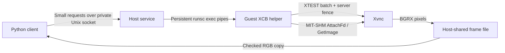

# Xvnc fast I/O implementation and acceptance

Implemented on 2026-09-07 in the standalone lab, using the existing patched
gVisor **systrap** runtime inside unprivileged Apptainer. Xvnc remains the display
server. No new engine patch, host sudo, KVM access, network port or host display
server is required. Mutter/Wayland implementation remains deferred by the user's
choice; this establishes the Xvnc baseline first.

## Using it

Build once on this Slurm node (the compiler and XCB headers are already present):

```bash
cd ~/scratch/general-vm
scripts/build-fast-io.sh
python scripts/fastio.py screenshot ENV --backend xvnc --output /tmp/frame.png
python scripts/fastio.py action ENV --action '{"mouse":{"left_click":[400,400]}}'
python scripts/fastio.py step ENV --action '{"keyboard":{"text":"Hello!"}}' --output /tmp/after.png
python scripts/fastio.py close ENV
```

The environment and its Xvnc desktop must be running. The first operation starts
a local service and installs the content-addressed guest helper. Subsequent CLI
calls use that same service. `close` detaches it without stopping the desktop.
The CLI writes PNG/JPEG for convenience; image encoding and file writes are not
part of the in-memory latency measurements below.

For an agent loop, use the Python API from `scripts/`:

```python
from environment import EnvironmentManager

manager = EnvironmentManager()
with manager.fast_io("ENV", backend="xvnc") as desktop:
    ack = desktop.action({"mouse": {"move": [400, 400]}})
    image = desktop.screenshot()  # Fresh Xvnc readback, owned PIL RGB pixels.
    image, metadata = desktop.step([
        {"keyboard": {"keys_down": "ctrl"}},
        {"mouse": {"left_click_drag": [[200, 400], [700, 500]]}},
        {"keyboard": {"keys_up": "ctrl"}},
    ])
    previous_image = desktop.screenshot(fresh=False)
```

Closing the Python context releases that client's mapping. The per-environment
service remains available until explicitly closed or the environment stops.
Use separate client objects for concurrent threads. `backend="xvnc"` and
`--backend xvnc` identify the implemented backend; `wayland` is rejected until
it has a working implementation. This is a lab API, not an integration into
Gym Anything's runner yet.

Supported actions follow the existing mouse/keyboard dictionary convention:
move; left/middle/right click; double/triple click; left/right drag through a
list of points; vertical scroll (positive means down); explicit button down/up;
keyboard text, key chords, and keys down/up. A list combines them into one
ordered batch and one acknowledgment. Coordinates are absolute desktop pixels.
The helper validates the whole batch before emitting input. Text uses US-layout
key events, including temporary unused keycodes for otherwise unmapped Unicode.
A large set of distinct unmapped characters can exhaust those spare keycodes;
the request is rejected before input, and closing the service restores the map.
Close the service before changing keyboard layouts. Lock keys and already-held
modifiers retain their normal X11 effects. This is not clipboard substitution.

## Data path and acknowledgments



`runsc exec --pass-fd` imports a bounded host file descriptor into the helper.
MIT-SHM 1.2 transfers that descriptor to Xvnc over its local X socket. Xvnc writes
screenshots directly into the host-visible mapping. Neither RFB/VNC encoding nor
an image payload over TCP is involved. The guest helper does not copy the entire
frame into a second guest buffer. Xvnc still copies its framebuffer into the
shared buffer, and PIL converts/copies BGRX to owned RGB pixels on the host.
This is not a claim of zero copies throughout the graphics pipeline.

The NVIDIA/VirtualGL path already brings rendered application pixels into Xvnc.
Fast I/O captures that resulting desktop just as it captures CPU-rendered pixels.
It does not eliminate upstream GPU readback or compositor scheduling.

Input uses checked XTEST requests, followed by one X-server reply that fences
the batch. The acknowledgment is **X-server processing**, not application event
handling, drawing completion, or a GPU completion fence. A fast drag preserves
its endpoint and held-button/modifier ordering; applications may coalesce its
intermediate motion. Submit separately timed actions when those intermediate
states need to be visible to the application.

`step` starts its fresh readback after that input fence. Metadata includes the
input sequence, frame sequence, helper generation and guest capture timestamps.
Sequences restart when the helper reconnects; compare them only within one
generation. A frame records the latest input sequence preceding its capture.
The returned image is stable after later captures. Concurrent frame readers
validate an even, unchanged publication sequence; if necessary only observation
is retried. Submitted input is never automatically replayed after a lost reply.
A failed guest channel is marked unusable to prevent consuming a stale reply
as the acknowledgment of a later action.

`screenshot(fresh=False)` returns the most recent **explicitly captured** frame;
there is no background capture loop. Its metadata can therefore be old even
while applications are animating. Fresh capture works on a completely static
desktop without waiting for a damage event. The current path captures the root
visual without compositing the separate hardware cursor, supports live resize,
and is qualified for little-endian, depth-24 BGRX Xvnc desktops. The sparse shared
file has a 64 MiB pixel limit; only touched pages consume memory.

Guest and host monotonic clocks have different offsets. Guest timestamp
subtraction measures capture duration. `host_frame_observed_ns` and
`observed_frame_age_ns` measure age since the host received that frame's reply;
they are not an exact time since the application's repaint.

## Pause, save, restore and stop

Exec-donated descriptors are explicitly non-restorable in gVisor
(`sources/gvisor/pkg/sentry/control/proc.go`, `Restorable: false`). Leaving a
host-backed SHM attachment in a saved Xvnc would be unsafe.

The managed pause/save paths therefore detach SHM from Xvnc, fence the detach,
restore temporary key mappings and reap the helper before freezing. Held normal
keys/buttons are not deliberately released. The desktop applications remain
resident. The next operation after resume or restore creates a new helper,
shared buffer and generation. The persistent guest installation is ordinary
filesystem state and is included in filesystem snapshots.

Lifecycle operations take an exclusive per-environment lock; fast I/O takes a
shared lock for each operation. A lifecycle operation in progress rejects new
input. If clean detachment fails, save/pause fails rather than proceeding with
the shared mapping attached. Explicit discard can terminate the helper's owned
host process group while deleting the entire sandbox, including when a caller
has paused it directly through runsc. Use the managed APIs for pause and save;
raw runsc checkpoint bypasses this integration.

The host socket directory is private to the user, connections check peer UID,
and each environment receives only its own frame descriptor. No shared-memory
mount exposing other environments is added. The host service inherits the
Sentry's CPU affinity. Its small control-process CPU/RSS and the consumer's RGB
images are host-side costs, outside the guest memory budget and guest CPU
controller; this change does not create a host cgroup resource guarantee.

## Measurements on babel-u5-28

Each final warm benchmark uses 200 calls per operation and resolution, after ten
warm-up captures. Times include the local Python request, acknowledgment, and,
for screenshots/steps, an owned PIL RGB image. The GPU page animates continuously
in Firefox WebGL and reports `NVIDIA L40S/PCIe/SSE2`. Other host and GPU workloads
were present; these are observed distributions, not isolated throughput limits.

Values are **median / p95 milliseconds**:

| Desktop | Resolution | Action | Fresh screenshot | Action + screenshot |
|---|---|---:|---:|---:|
| CPU GTK | 1280×800 | 1.72 / 2.39 | 4.94 / 5.60 | 5.23 / 6.11 |
| GPU Firefox | 1280×800 | 1.53 / 4.15 | 6.12 / 9.03 | 5.52 / 8.43 |
| CPU GTK | 1920×1080 | 1.60 / 2.02 | 3.86 / 7.91 | 8.08 / 9.09 |
| GPU Firefox | 1920×1080 | 5.22 / 9.55 | 9.12 / 15.82 | 7.29 / 15.46 |

Latest-frame medians were 1.5–2.2 ms. Starting the service, installing the helper
and obtaining the first image took 357 ms in the final cold connection sample.
That startup cost recurs after detachment/reconnection, not on every action.
Higher-resolution GPU tail latency remains above 10 ms.

A separate **read-only** test captured the user's actual Resolve desktop at
1920×1080: 6.38 ms median / 9.43 ms p95 over 50 screenshots. The Resolve UI and
timeline were visible and inspected; its playhead was beyond the short test clip,
so both viewers were black. Playback was not changed or benchmarked by this test.

**Observing a changed application pixel is a different measurement.** In 30
clicks per application, the immediate `step` screenshot still contained the old
color every time. Polling fresh screenshots until the new color appeared took
about 21 ms median for GTK and 55 ms median for Firefox WebGL. The GPU p95 was
137 ms, with a 456 ms outlier in the final shared-node run. These numbers include
a 5 ms polling interval and application/render/compositor delays. The earlier
GPU run was 56 ms median / 68 ms p95. Fast capture must not be described as a
promise that a browser or GPU application repaints within 10 ms.

Full timings, guest-side durations and lifecycle evidence are in
[fast-io-evidence/](fast-io-evidence/). The preceding lifecycle run and the final
latency run are retained separately; their variation is intentional evidence.

## Validation and scope

The subsequent [100-case cua-auto-harness audit](cua-harness-fast-io.md)
records broader action coverage and a reproduced limit: spare Unicode keycodes
can be exhausted across a sequence of otherwise short text actions.

Passed live checks include actual GTK text (ASCII, punctuation, accents, Greek
and CJK codepoints), Ctrl-drag delivery at the correct endpoint, repeated clicks,
scrolling, atomic rejection of an invalid batch, owned-image stability, fresh
versus cached semantics, concurrent readers, and resize to 1080p and back.
The CJK text matched exactly in GTK's entry state; this image lacks a CJK font
and displays a missing-glyph box for that character.

CPU live restore preserved the application's nonce and text and accepted another
click. GPU pause/resume and filesystem cold restore reconnected capture. A final
CPU stop-with-save terminated the source before a fresh clone was loaded and
accepted input. Discard also succeeded with a GPU helper present in a sandbox
paused directly through runsc. Test environments and their services were then
stopped; the user's existing desktops were preserved.

The existing CPU lifecycle regression (including a quota-controlled peer) and
unit suites for lifecycle, fast I/O, filesystem snapshots, snapshot storage and
CPU scheduling passed. Actual screenshots were opened and inspected. This does
not qualify live graphics-state checkpointing, Wayland, every keyboard layout,
or Gym Anything's entire environment/task suite.

Re-run the host checks with:

```bash
python scripts/test-fast-io.py
python scripts/test-environment.py
python scripts/test-filesystem-snapshot.py
python scripts/test-snapshot-store.py
python scripts/test-cpu-broker.py
```

The live harness is `scripts/test-fast-io-live.py fastio-NAME [--gpu] [--lifecycle]`.
It requires an explicitly selected disposable `fastio-*` desktop running
`scripts/fast-io-input-probe.py` as guest user `ga`, with `DISPLAY=:1` and
`XAUTHORITY=/home/ga/.Xauthority`. The probe listens on the already-forwarded guest
port 8000. GPU mode opens its `/gpu` page in Firefox through `engine-gpu-gl`, with
`MOZ_X11_EGL=0`; dismiss Firefox's first-run dialog before acceptance. The full
reproduction setup is shown below.

```python
# Run from the lab with PYTHONPATH=scripts. Use a fresh disposable name.
from pathlib import Path
import subprocess
import time
from environment import EnvironmentManager

m = EnvironmentManager()
name = "fastio-example"
m.start(name, options=["--guest-gs", "--no-runtime-debug"])
command = m._command(name)
for attempt in range(120):
    try:
        m._run([*command, "exec", name, "systemctl", "is-active",
                "tigervncserver@:1.service"])
        break
    except RuntimeError:
        time.sleep(.5)
else:
    raise TimeoutError("Xvnc did not become ready")
subprocess.run([*command, "exec", name, "sh", "-c",
                "cat > /opt/fast-io-input-probe.py"], check=True,
               input=Path("scripts/fast-io-input-probe.py").read_bytes())
m._run([*command, "exec", name, "systemd-run", "--unit=fast-io-input-probe",
        "--uid=ga", "--setenv=DISPLAY=:1", "--setenv=XAUTHORITY=/home/ga/.Xauthority",
        "python3", "/opt/fast-io-input-probe.py"])
# After testing: m.stop(name, discard=True).
```

Build provenance records compiler, system XCB packages and source/binary hashes
in `tools/fast-io/build.json`; the tested copy is committed in the evidence folder.
Binaries, screenshots, snapshots, host sockets and runtime logs remain deliberately
ignored. The source and tests are tracked in Git.
